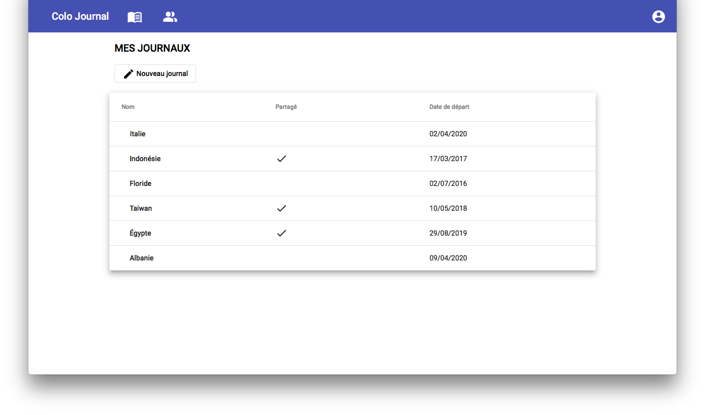

# ColoJournal

Cette application permet à des utilisateurs de rédiger des journaux et de les partager avec des amis.

##  Fonctionnalités

*  Création de compte
*  Création de journaux
*  Rédaction d'articles
*  Demande d'amitié
*  Partager ses journaux

##  Technologies

*  Django / Django REST Framework
*  Angular / RxJS
*  PostgreSQL
*  Travis 

## Screeshots

